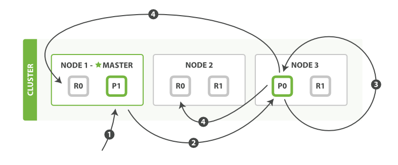

elasticsearch

### 索引

索引是指向一个或者多个物理分片的逻辑命名空间

### 分片

分片是一个底层的工作单元，保存了全部数据的一部分，

一个分片是一个Lucene的实例，同时本身就是一个完整的搜索引擎

es利用分片将数据发往集群内部。

分片是数据的容器，文档保存在分片内，分片被分配到集群的各个节点

一个分片可以是主分片或者是副本分片，索引内任意的一个文档归属于一个主分片，主分片的数目决定索引能够保存的最大数据量

索引建立的时候已经确定了主分片数量，但是副本分片可以随时修改

**从技术上来说，一个主分片最多可以存储128个文档**


### 扩展

默认主分片为5

number_of_replicas：1 设置复制分片的数量1

以上的配置，那么就是5个主分片，5个复制分片，那么最多可以扩展到10个nodes

如果需要扩展到更多的nodes，那么需要修改number_of_replicas的数量


### 故障转移

如果其中一个node故障（假定为master节点）,那么会发生以下事件

+ 选取新主节点
+ 由于故障节点存在主分片，新的主节点会将其他node的副本提升为主分片

### 文档

es中的文档是指最顶层或者根对象，这个根对象被序列化为JSON对象并存储在es，指定了唯一的ID

* 元数据
   + _index

      文档存放位置
   + _type

      文档表示的对象类别
   + _id

      文档的唯一标识

#### 获取文档

默认情况下，GET请求会返回整个文档，如果我们只对其中的部分字段感兴趣，单个字段能用_source参数获得，多个字段能通过逗号分割的列表制定

```
GET /website/blog/123?_source=title,text
```

如果只想得到_source字段，不需要任何元数据
```
GET /website/blog/123/_source
```

#### 部分更新文档

update API可以部分更新文档

* update 请求最简单的一种形式是接收文档的一部分作为 doc 的参数

```
POST /website/blog/1/_update
{
   "doc" : {
      "tags" : [ "testing" ],
      "views": 0
   }
}
```

给文档添加2个字段

* 使用脚本部分更新文档

脚本可以在update API中改变_source的字段内容，它在更新脚本中成为ctx._source

```
POST /website/blog/1/_update
{
   "script" : "ctx._source.views+=1"
}
```

* 通过tags数组添加一个新的标签

```
POST /website/blog/1/_update
{
   "script" : "ctx._source.tags+=new_tag",
   "params" : {
      "new_tag" : "search"
   }
}
```

* 设置ctx.op为delete删除基于内容的文档

```
POST /website/blog/1/_update
{
   "script" : "ctx.op = ctx._source.views == count ? 'delete' : 'none'",
    "params" : {
        "count": 1
    }
}
```

* 更新的文档不存在

upsert 参数，制定文档不存在则创建

```
POST /website/pageviews/1/_update
{
   "script" : "ctx._source.views+=1",
   "upsert": {
       "views": 1
   }
}
```

第一次运行是，upsert作为新文档被索引 ，初始化views为1，后续的运行中，文档存在，script更新操作替代upsert应用

* 更新和冲突

如果
retry_on_conflict 设置失败之前重试的次数

* 取回多个文档

mget api将多个检索请求放到一个请求中，可以加快速度

多个请求中，如果其中一个未找到，并不妨碍其他文档被检索到，同时，请求的http状态码仍然为200，如果需要查看某个文档是否查找到，需要检查found标记

* 较小的代价批量操作

mget允许批量取回多个文档，bulk api允许在单个步骤中进行多次的create\index\update\delete请求
格式
{action:{metadata}}\n
{request body }\n
{action:{metadata}}\n
{request body}\n

默认配置，http的请求长度应该是不能超出100M，如果超出则需要调整http.max_content_length设置

一般建议bulk请求体的大小在15Mb，这里的15M，仅仅是指请求体的字节数，而不是bulk size，

bulk size 一般指数据的条目数

### 路由一个文档到一个分片

当索引一个文档时，文档会被存储在一个主分片中，决定文档存储在那个分片的公式

```
shard=hash(routing) % number_of_primary_shards
```
* routing是可变值，默认是文档的_id,也可以自定义。分片分布在0 -
* nuber_of_primary_shards-1之间
* 主分片的数量不能更改，更改后无法找到文档

所有的文档api都可以接受routing的路由参数，通过这个参数可以自定义文档到分片的映射，一个自定义的路由参数可以用来确保所有相关的文档--例如同一个用户的文档--被存储在同一分片

### 主分片和副本分片交互

可以将请求发送到集群的任意节点，每个节点都有能力处理请求，每个节点知道集群中任意文档位置,接收到请求的节点称为 **协调节点**


**发送请求的时候，为了负载均衡，更好的做法是轮训集群中所有节点**

* 新建、索引、删除文档

客户端 -->  协调节点 --> 主节点 --> 复制节点 --> 主节点 --> 协调节点 --> 客户端


* consistency

默认设置下，在执行写操作前，主分片都要求必须有规定数量的分片副本处于活跃可用状态，才会去执行写操作

规定数量公式：

```
int(primary + number_of_replicas)/2) + 1
```

consistency可以设置为one、all、quorum默认值为quorum

** 新索引默认1个副本分片，这意味需要有2个活动的分片副本，但是默认的设置会阻止只有单一节点的情况，为了避免这个问题，只有number_of_replicas>1 规定才会执行**

* 局部更新文档


    +  客户端向node 1 发送更新请求
    +  请求转发到主分片node 3
    +  node 3 从主分片检索文档，修改_source中的JSON，并且尝试重新索引主分片的文档，如果文档被另一个进程修改，会重试步骤3，超过retry_on_conflict后放弃
    +  如果node 3 成功更新文档，将新版本的文档并行转发node1和node2，重新建立索引，所有分片返回成功，node3向协调节点返回成功，协调节点向客户端返回成功

* 多文档模式


    + mget 获取多个文档
        - 客户端向node 1 发送mget请求
        - node 1为每个分片构建多文档获取请求，然后并行转发到主分片或者副本分片，一旦都到所有答复，node 1 构建响应并将响应返回给客户端
    + bulk 修改多个文档
        - 客户端向node 1 发送bulk请求
        - node 1 为每个节点创建一个批量请求，将这些请求并行煮饭给每个包含主分片的节点
        - 主分片顺序执行每个操作，操作成功，主分片并行转发新文档到副本分片，然后执行下一个操作，一旦所以的副本分片报告所有操作成功，该节点将向协调节点报告成功，协调节点收集整理响应并返回客户端

### 搜索

文档中的每个字段都将被索引并且可以查询

#### 分析（analysis）与分析器
分析包含下面的过程：
  + 将文本分成合适倒排索引的独立的词条
  + 将词条统一化为标准格式以提高他们的搜索性
  分析器执行上面的工作，实际上是将三个功能封装
  + 字符过滤器
  + 分词器
  + token 过滤器

#### 映射
为了将时间域视为时间，数字域视为数字，字符串视为全文或者精确字符串，es需要知道每个域中数据的类型，这个信息包含在映射中

es支持以下域类型
  * 字符串： string
  * 整数： byte, short, integer, long
  * 浮点数: float, double
  * 日期： date

* 查看映射
  /_mapping 查看es在一个或者多个索引中的一个或者多个类型的映射

当索引一个包含新域的文档--es会使用动态映射，通过JSON中基本数据类型，尝试猜测域类型

* 自定义域映射
  自定义映射允许执行下面的操作
  + 全文字符串域和精确值字符串域的区别
  + 使用特定语言分析器
  + 优化域以适应部分匹配
  + 指定自定义数据格式
  + 还有更多
    默认，string类型域会被认为包含全文，就是说，他们的值在索引前，会通过一个分析器，针对这个域的查询在搜索前也会经过一个分析器
    string域映射的2个最重要的属性是**index** **analyzer**

* index
  index属性控制怎样索引字符串，可以是下面三个值
  + analyzed（默认值）  首先分析字符串，然后索引它，换句话，以全文索引这个域
  + not_analyzed 索引这个域，所以他能够被搜索，但索引的是精确值
  + no 不索引这个域，这个域不会被索引到

* analyzer
  默认es使用standard分析器，可以使用一个内置的分析器替代它
```
{
   “tweet”： {
        ”type”： “string”，
        ”analyzer”： “english”
   }
}
```

* 更新映射

首次创建一个索引的时候，可以指定类型的映射，你也可以使用_mapping为新类型增加映射
**尽管可以增加一个存在的映射，但是不能修改存在的映射，如果映射已经存在，那么该域的数据可能已经被索引，如果试图修改，则可能导致索引的数据出错

* 新增加映射
  给tweet增加一个名为tag的文本域

```
  PUT /gb/_mapping/tweet
{
  "properties" : {
    "tag" : {
      "type" :    "string",
      "index":    "not_analyzed"
    }
  }
}
```

### 查询表达式

要使用查询表达式，只需要将查询语句传递给query参数
```
GET /_search
{
    "query": YOUR_QUERY_HERE
}

GET /_search
{
    "query": {
        "match_all": {}
    }
}
```
查询语句的结构
```
{
    QUERY_NAME: {
        ARGUMENT: VALUE,
        ARGUMENT: VALUE,...
    }
}
```
如果针对某个字段
```
{
    QUERY_NAME: {
        FIELD_NAME: {
            ARGUMENT: VALUE,
            ARGUMENT: VALUE,...
        }
    }
}
```

### 查询与过滤

es的QUERY DSL 含有一套查询组件，这套组件可以在以下2种情况使用：filtering context / query context
当使用filtering context时，查询被设置为不评分或者过滤查询，即这个查询只是简单的问，文档是否匹配，回答只是yes or no
当使用query context,那么查询就变成一个评分的查询，需要判断匹配度

### 查询与过滤的区别
* 过滤的速度快，查询慢
* 过滤会缓存结果到内存，查询不会缓存
* 过滤的目标是减少需要经过评分查询进行检查的文档

### 重要的查询

#### match 查询

无论是任何字段上进行的全文搜索还是精确查询，match是可用标准查询

#### multi_match查询

可以在多个字段上执行相同的match查询
```
{
    "multi_match": {
        "query":    "full text search",
        "fields":   [ "title", "body" ]
    }
}
```
#### range查询
查询在制定区间内的数字或者时间
```
{
    "range": {
        "age": {
            "gte":  20,
            "lt":   30
        }
    }
}
```
#### term查询
用于精确值匹配，这些精确值可能是数字、时间、布尔或者那些 not_analyzed 的字符串
```
{ "term": { "age":    26           }}
{ "term": { "date":   "2014-09-01" }}
{ "term": { "public": true         }}
{ "term": { "tag":    "full_text"  }}
```
#### terms查询
terms 查询和 term 查询一样，但它允许你指定多值进行匹配。如果这个字段包含了指定值中的任何一个值，那么这个文档满足条件
```
{ "terms": { "tag": [ "search", "full_text", "nosql" ] }}
```

### 组合多查询
bool查询可以将多查询组合一起，接受以下参数

* must
      文档必须匹配条件
* must_not
      文档必须不匹配
* should
      如果满足语句中的任意语句，将增加_score
* filter
      必须匹配，但不评分

### 验证查询
```
GET /gb/tweet/_validate/query?explain
```

### 索引管理

#### 创建一个索引
```
PUT /my_index
{
  "settings": { ... any settings ...}
  "mappings": {
    "type_one": { ... any mappings ...}
    "type_two": { ... any mappings ...}
    ...
  }
}
```
#### 删除索引
* 删除一个索引
```
delete /my_index
```
删除多个索引
```
delete /index_one,index_two
delete /index_*
delete /_all
delete /*
```
#### 索引设置
下面是2个最重要的设置
number_of_primary_shards
    每个索引的主分片数，默认为5，索引创建后不能修改
number_of_replicas
    每个主分片的副本数，默认为1，可以随时修改
```
PUT /my_temp_index
{
    "settings": {
        "number_of_shards" :   1,
        "number_of_replicas" : 0
    }
}

PUT /my_temp_index/_settings
{
    "number_of_replicas": 1
}
```
### 配置分析器

#### 自定义分析器
分析器就是一个包里面组合了三种函数的一个包装器，三种函数按照顺序执行

字符过滤器/分词器/词单元过滤器

#### 创建一个自定义分析器
```
PUT /my_index
{
    "settings": {
        "analysis": {
            "char_filter": { ... custom character filters ... },
            "tokenizer":   { ...    custom tokenizers     ... },
            "filter":      { ...   custom token filters   ... },
            "analyzer":    { ...    custom analyzers      ... }
        }
    }
}
```
示例：
```
* 使用html清除字符过滤器移除html部分
* 使用一个自定义的映射字符过滤器把&替换为"和":
"char_filter": {
    "&_to_and": {
        "type":       "mapping",
        "mappings": [ "&=> and "]
    }
}
```
* 使用标准分词器分词
* 小写词条，使用小写过滤器处理
* 使用自定义停止词过滤器移除自定义的停止次列表中包含的词
```
"filter": {
    "my_stopwords": {
        "type":        "stop",
        "stopwords": [ "the", "a" ]
    }
}
```

分析器定义用之前已经设置好的自定义过滤器组合
```
"analyzer": {
    "my_analyzer": {
        "type":           "custom",
        "char_filter":  [ "html_strip", "&_to_and" ],
        "tokenizer":      "standard",
        "filter":       [ "lowercase", "my_stopwords" ]
    }
}
```
完整的创建索引请求如下：
```
PUT /my_index
{
    "settings": {
        "analysis": {
            "char_filter": {
                "&_to_and": {
                    "type":       "mapping",
                    "mappings": [ "&=> and "]
            }},
            "filter": {
                "my_stopwords": {
                    "type":       "stop",
                    "stopwords": [ "the", "a" ]
            }},
            "analyzer": {
                "my_analyzer": {
                    "type":         "custom",
                    "char_filter":  [ "html_strip", "&_to_and" ],
                    "tokenizer":    "standard",
                    "filter":       [ "lowercase", "my_stopwords" ]
            }}
}}}
```
### 类型和映射

从技术上讲，多个类型可以在相同的索引中，只要他们的字段不冲突
类型可以很好的区分同一个集合中的不同细分，在不同的细分中数据的整体模式是相同的

如果有2个不同的类型，每个类型都有同名的字段，但映射不同，es将不会允许定义这个映射

每个lucene索引中的所有字段包含一个单一、扁平的模式，一个特定字段可以映射成string类型也可以是number，但是不能兼具


以上简单的说就是在一个索引里面，不同的type里面，同一个名称字段不能映射不同的类型

以下是具体的案例，从下面的映射看，在lucense里面，会将json数据映射到一个扁平的模式里面，在这个模式里面是没有type的
```
{
   "data": {
      "mappings": {
         "people": {
            "properties": {
               "name": {
                  "type": "string",
               },
               "address": {
                  "type": "string"
               }
            }
         },
         "transactions": {
            "properties": {
               "timestamp": {
                  "type": "date",
                  "format": "strict_date_optional_time"
               },
               "message": {
                  "type": "string"
               }
            }
         }
      }
   }
}
```
```
{
   "data": {
      "mappings": {
        "_type": {
          "type": "string",
          "index": "not_analyzed"
        },
        "name": {
          "type": "string"
        }
        "address": {
          "type": "string"
        }
        "timestamp": {
          "type": "long"
        }
        "message": {
          "type": "string"
        }
      }
   }
}
```

#### 根对象
映射的最高一层被称为根对象，它可能包含以下几项
* 一个properties节点，列出文档中可能包含的每个字段的映射
* 各种元数据字段
* 设置项，控制如何动态处理新的字段，例如 analyzer、dynamic_data_formats和dynamic_templates
* 其他设置，可以同时应用在根对象和其他类型的字段上例如enabled、dynamic和include_in_all

#### 属性
* type
  字段的数据类型，例如string或date
* index
  字段是否被当成全文来搜索(analyzed),或被当成一个准确的值（not_analyzed)，还是完全不可搜索（no）
* analyzer
  确定在索引和搜索时全文字段使用的analyer

#### 元数据:_source字段
默认，es在_source字段存储达标文档体的json字符串，和所有被存储的字段一样，在被写入磁盘前会压缩
这个字段的存储几乎总是我们想要的，因为它意味着下面的这些：

* 搜索结果包括了整个可用的文档——不需要额外的从另一个的数据仓库来取文档。
* 如果没有 _source 字段，部分 update 请求不会生效。
* 当你的映射改变时，你需要重新索引你的数据，有了_source字段你可以直接从Elasticsearch这样做，而不必从另一个（通常是速度更慢的）数据仓库取回你的所有文档。
* 当你不需要看到整个文档时，单个字段可以从 _source 字段提取和通过 get 或者 search 请求返回。
* 调试查询语句更加简单，因为你可以直接看到每个文档包括什么，而不是从一列id猜测它们的内容。

#### 元数据： _all字段
把其他字段值当做一个大字符串来索引的特殊字段
如果查询不指定字段则使用_all
_all是一个仅仅经过分词的string字段，使用默认的分词器来分析
如果不需要all字段
```
PUT /my_index/_mapping/my_type
{
    "my_type": {
        "_all": { "enabled": false }
    }
}
```
可以为_all配置分词器
```
PUT /my_index/my_type/_mapping
{
    "my_type": {
        "_all": { "analyzer": "whitespace" }
    }
}
```

#### 元数据： 文档标识

默认情况下,
_uid 字段是存储和索引的
_type字段被索引的但是但是没有存储
_id和i_index字段既不索引也不存储，意味着他们并不是真实存在的

### 分片内部原理

#### 倒排索引的不变性

倒排索引在被写入磁盘后是不可改变的，带来的优点：
* 不需要锁
* 一旦索引被读入文件缓存，只要缓存有足够的空间，就会一直使用缓存
* 允许数据被压缩
#### 倒排索引动态更新

如何解决在保持不变的前提下实现倒排索引的更新，答案是用更多的索引
通过增加新的补充索引来反映最近的修改，而不是直接重写整个倒排索引，每个索引会被轮询，查询完后再对结果进行合并

es基于lucene，lucene引入了按段搜索的概念，每一段都是一个倒排索引，索引在lucene中除表示段的集合外，还增加了提交点的概念

容易被混淆的概念是
一个lucene索引在es被称为分片，一个es的索引是分片的集合

逐段搜索流程：
* 新文档被收集到内存索引缓存
* 不时，缓存被提交
   + 一个新的段被写入磁盘
   + 一个新的包含新段名字的提交点被写入磁盘
   + 磁盘同步---所有在文件系统缓存中等待的写入都刷新到磁盘，以确保写入物理文件
* 新的端被开启，包含的文档可被搜索
* 内存缓存被清空，等待接收新文档

#### 持久化变更
* 当一个文档被索引，被加入到内存缓存，同时加入到translog

* 以每s的频率将buff的文档写入到文件系统缓存（段），但是没有fsync
    - 段被打开，新的文档可以被搜索
    - 文件系统缓存被清除

* 更多的文档被加入到缓存，写入日志，过程会继续
* 不时地（默认30分钟，或者日志超过512MB)，日志很大，新的日志被创建，进行一次全提交
    - 内存缓存区的所有文档会写入到新段
    - 清除缓存
    - 一个提交点写入硬盘
    - 文件系统fsync到硬盘
    - translog被清除

### 深入搜索

#### term/terms过滤

term/terms是包含操作，而非等值判断
如果期望得到完全相等的行为，最好的方式是增加并索引另一个字段


### 全文搜索

#### 基于词项的查询
如term和fuzzy这样的查询，不需要分析阶段，他们对单个词项进行操作，用term查询词项foo 只要在倒排索引查找'准确词项',并且用TF/IDF算法为每个包含词项的文档计算相关度评分

term查询只对倒排索引的词项精确匹配，不会对词的多样性进行处理（比如foo或者FOO）

#### 基于全文的搜索
像match或query_string这样的查询是高层查询，他们了解映射字段的信息
+ 如果查询日期或者整数字段，他们会讲查询字符串分别作为日期或整数对待
+ 如果查询一个（not analyzed）未分析的精确值字符串字段，他们会讲整个查询字符串作为单个词项对待
+ 如果查询一个已分析的全文字段，它们会先将查询字符串传递到一个合适的分析器，然后生成一个供查询的词项列表

#### 匹配查询
match是个核心查询，它是一个高级全文查询，既能查询全文字段，又能处理精确字段

+ 单个词查询
```
GET /my_index/my_type/_search
{
    "query": {
        "match": {
            "title": "QUICK!"
        }
    }
}
```
es执行上面的match查询的步骤
1、检查字段类型
title是一个string类型，意味着查询字符串需要分析
2、分析查询字符串
将QUICK传入标准分析器，输出的结果是单个项quick，因为只有一个单词项，所以match查询执行的是单个底层term查询
3、查找匹配文档
用term查询在倒排索引中查找quick，然后获取一组包含该项的文档
4、为每个文档评分
用 term 查询计算每个文档相关度评分 _score

+ 多次查询
```
GET /my_index/my_type/_search
{
    "query": {
        "match": {
            "title": "BROWN DOG!"
        }
    }
}
```
内部执行2次term查询，然后将2次查询的结果合并


### 部署

其它数据库可能需要调优，但总得来说，Elasticsearch 不需要。 如果你遇到了性能问题，解决方法通常是更好的数据布局或者更多的节点。 在 Elasticsearch 中很少有“神奇的配置项”， 如果存在，我们也已经帮你优化了！

* 最小主节点数目
  discovery.zen.minimum_master_nodes: 2
  可以通过动态的方式调整，调整后，将成为一个永久配置，无论配置文件里面的配置如何，这个会有限生效
```
PUT /_cluster/settings
{
    "persistent" : {
        "discovery.zen.minimum_master_nodes" : 2
    }
}
```

* 集群恢复方面的配置
  gateway.recover_after_nodes： 8
  gateway.expected_nodes: 10
  gateway.recover_after_time: 5m

以上配置意味
* 等待集群至少8个节点
* 等待5分钟，或者10个节点上线后，才进行数据恢复，取决于那个条件先达到

可以在集群重启的时候避免过多的分片交换，会让数据恢复从几个小时缩短为几秒钟
这些配置不能动态更新

#### 使用单播代替组播
防止节点意外加入生产环境

### 不要触碰以下配置

* 垃圾回收器
* 线程池
  大多数的I/O操作是由lucene线程管理的，而不是es

#### 堆内存
es默认安装后的堆内存是1G，对于业务来说，可能太小了

* 把你的内存的一半给lucene
  对于es来说，除了堆内存，还有一个内存消耗大户，非堆内存：lucene

lucene设计为可以利用操作系统底层机制来缓存内存数据结构，lucene的段是分别存储在单个文件的，段是不可变的，因此文件也不会变化，这是对缓存友好的
如果把内存都留给堆内存，那么就不会有内存给lucene，从而导致检索缓慢

* 不要超过32Gb
* 关闭swapping
  vm.swappiness = 1
* 文件描述符和mmap
  + 足够的文件描述符
  + 足够的mmapped文件
     sysctl -w vm.max_map_count=262144


### 索引性能技巧

#### 科学的性能测试
合理的测试方法如下：
+ 在单个节点上，对单个分片，无副本的场景测试性能
+ 在100%默认配置的情况下记录性能结果，这样就有了一个对比基线
+ 确保性能测试运行足够长的时间（30分钟以上）这样可以评估长期性能，而不是短期的峰值或延迟
+ 开始在基线上逐一修改默认值，严格测试

#### 使用批量请求并调整其大小
应该使用批量请求，每次请求5-15M的数据，然后缓慢增加，测试性能

#### 段和合并

es会自动限制索引请求到单个线程里，es在默认设置里面比较保守，不希望搜索被后台合并影响，不过对于ssd硬盘，限流阀值太低

默认为20M/s，对机械硬盘是个不错的设置，如果用ssd，则可以考虑提高到100-200M
```
PUT /_cluster/settings
{
    "persistent" : {
        "indices.store.throttle.max_bytes_per_sec" : "100mb"
    }
}
```
如果在做批量导入，完全不在意搜索，可以彻底关闭限流
```
PUT /_cluster/settings
{
    "transient" : {
        "indices.store.throttle.type" : "none"
    }
}
```

如果使用机械硬盘，需要添加如下的配置
```
index.merge.scheduler.max_thread_count: 1
```

机械硬盘在并发i/o支持方面差，所以需要降低每个索引并发访问磁盘的线程数，这个设置允许1+2个线程进行磁盘操作

#### 其他
* 如果不需要近实时搜索，可以考虑把索引的index.refresh_interval改到30s
* 如果做大批量导入，考虑设置index.number_of_replicas:0关闭副本，文档在复制的时候，整个文档内容都被发往副本，然后重新索引及合并
  如果关闭副本，等写入完成之后再开启副本，恢复过程本质上只需要复制字节

#### 推迟分片分配
如果在确认有问题的节点很快会重新恢复，则可以推迟分片分配，否则可能会造成大量的不必要的开销（分片提拔、节点建数据拷贝，分片移动等等）

修改默认延时
```
PUT /_all/_settings
{
  "settings": {
    "index.unassigned.node_left.delayed_timeout": "5m"
  }
}
```
通过_all索引，可以为集群里面所有的索引使用这个参数
默认时间修改为5分钟

延迟分配不会阻止副本被提拔为主分片，集群还是会进行必要的提拔来让集群回到yellow

#### 自动取消分片迁移
如果节点在超时之后再回来，且集群还没有完成分片的移动，会发生什么事情呢？在这种情形下， Elasticsearch 会检查该机器磁盘上的分片数据和当前集群中的活跃主分片的数据是不是一样 — 如果两者匹配， 说明没有进来新的文档，包括删除和修改 — 那么 master 将会取消正在进行的再平衡并恢复该机器磁盘上的数据。

之所以这样做是因为本地磁盘的恢复永远要比网络间传输要快，并且我们保证了他们的分片数据是一样的，这个过程可以说是双赢。

如果分片已经产生了分歧（比如：节点离线之后又索引了新的文档），那么恢复进程会继续按照正常流程进行。重新加入的节点会删除本地的、过时的数据，然后重新获取一份新的。


### query string query

top level 参数
query  需要被解析的查询
default_field   如果不指定，默认是_all，如果_all被禁止，会自动选择可查询的字段
default_operator 默认为OR
analyzer 分析器名称

#### 多字段
使用fields参数
fields: ["field1", "field2"]
字段之间默认是OR操作

#### query string语法

* field names

status:active

下面2个查询是等价的
title：（quick OR brown)
title: (quick brown)

如果要包含精确的的词语，可以用quota
author:"john smith"  查询作者为john smith 而不是 john OR smith

如果需要查询非null
_exists_:title

#### wildcards（通配符）

通配符查询会使用大量的内存并且执行效率差

#### 正则表达式

name:/joh?n(ath[oa]n)/

#### 模糊查询

quick~ brwn~ foks~

查询all terms 允许最大2个改变，改变可以是以下的情形
* insertion
* deletion
* substitution of a single character
* transposition of two adjacent characters

缺省的变化值为2，可以进行修改
quikc~1

#### 距离查询

允许指定的单词距离远或者不同的顺序
“fox quick”～5

query string中越接近原始文本中字段的顺序，则相关性越高

"quick fox" 就比 "qucik brown fox"的相关性高

#### 范围
{min TO max}
date: [2012-01-01 TO 2012-12-31]
count:[1 TO 5]
如果只有1个边界，则可以使用
age: >10
age: >=10
age: <10

#### boosting
使用boost操作符^可以使1个term比另外一个term更有相关性，缺省的boost=1

quick^2 fox

#### boolean

首选的操作符为+(must) and -(must not),
quick brown +fox -news
fox必须存在，news一定不存在，其他为可选择的，其他的存在可以增加相关性

AND OR NOT 操作符也可以写成 && || !

#### grouping
(quick OR brown) AND fox


### query DSL

#### query context

查询上下文主要回答文档和查询的匹配情况，查询会计算_score

#### filter context

过滤上下文主要是回答查询是否匹配文档，不需要计算score,主要用来过滤结构化的数据，比如
* 时间戳是否在2015-2016之间
* 状态是否设置为published

filter会自动缓存


### 常用命令

* 查看master信息
```
curl 'localhost:9200/_cat/master?v'
```
* 查看健康状态
```
curl 'localhost:9200/_cat/health?v'
```
* 查看节点信息
```
curl 'localhost:9200/_cat/nodes?v'
```
* 查看分配信息
```
curl 'localhost:9200/_cat/allocation?v'
```
* 查询索引信息
```
curl 'localhost:9200/_cat/indices?v'
```
* 查询节点负载
```
curl 'localhost:9200/_cat/fielddata?v'
```
* 查看恢复信息
```
curl 'localhost:9200/_cat/recovery?v'
```
* 查看线程池信息
```
curl 'localhost:9200/_cat/thread_pool?v
```
* 查看分片信息
```
curl 'localhost:9200/_cat/shards?v'
```
* 关掉一个节点
```
curl 'localhost:9200/_cluster/nodes/_local_shutdown'
curl -XPOST 'http://localhost:9200/_cluster/nodes/nodeId1,nodeId2/_shutdown'
curl -XPOST 'http://localhost:9200/_cluster/nodes/_master/_shutdown'
```
* 关掉所有节点
```
curl -XPOST 'http://localhost:9200/_shutdown'
curl -XPOST 'http://localhost:9200/_cluster/nodes/_shutdown'
curl -XPOST 'http://localhost:9200/_cluster/nodes/_all/_shutdown'
```

* 集群统计

```
curl http://localhost:9200/_cluster/stats?human&pretty
```

